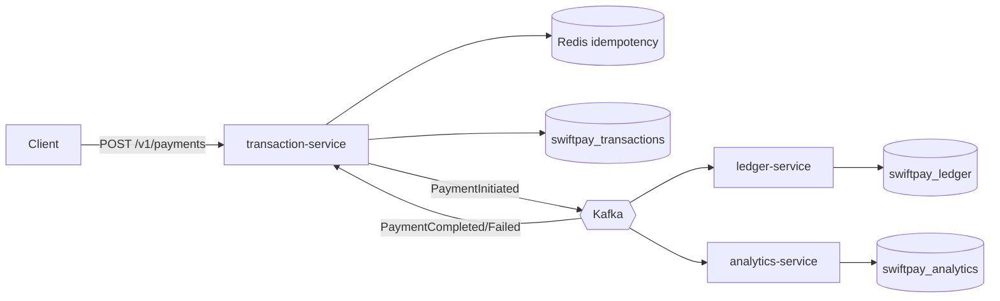

# SwiftPay — Event-Driven Fintech Payment Platform

SwiftPay is a production-oriented microservices payment platform built with **Java 21**, **Spring Boot 3**, **PostgreSQL**, **Apache Kafka**, and **Redis**. It demonstrates clean/hexagonal architecture, idempotent APIs, asynchronous settlement, and cloud-native deployment patterns.

## Architecture



### Design decisions

| Decision | Rationale |
|----------|-----------|
| **Hexagonal architecture** per service | Domain logic is isolated from Spring/Kafka/JPA adapters; easy to test and swap infrastructure. |
| **Database-per-service** | Each microservice owns its schema (`swiftpay_transactions`, `swiftpay_ledger`, `swiftpay_analytics`) for independent scaling and deployment. |
| **Redis idempotency (24h TTL)** | Fast duplicate detection at the API edge before DB write; `SET NX` prevents race conditions. |
| **Async ledger settlement** | API returns `202 Accepted` with `PENDING` immediately; ledger processes debit/credit without blocking the client. |
| **Outcome events update transaction status** | Ledger publishes `PaymentCompleted`/`PaymentFailed`; transaction-service consumes and updates its aggregate—keeps bounded contexts separate. |
| **Pessimistic account locking** | `SELECT … FOR UPDATE` on accounts ensures atomic balance transfer under concurrent Kafka consumers. |
| **Kafka retry + DLT** | Ledger consumer retries 3× with 1s backoff, then routes poison messages to `payment.initiated.DLT`. |
| **JPA entities + `ddl-auto: update`** | Tables/indexes are generated from entity classes on startup (hackathon-friendly). |
| **Indexed columns** | `idempotency_key`, `status`, `created_at`, `transaction_id` support high TPS lookups. |

## Services

| Service | Port | Responsibility |
|---------|------|----------------|
| `transaction-service` | 8081 | Payment API, idempotency, transaction persistence, event publish/consume |
| `ledger-service` | 8082 | Debit/credit, insufficient balance handling, outcome events |
| `analytics-service` | 8083 | Metrics from completed payments |

## Prerequisites

- Java 21+
- Maven 3.9+
- Docker & Docker Compose
- (Optional) Kubernetes, K6

## Quick start (Docker Compose)

```bash
# Start infrastructure + all services
docker compose up --build -d

# Verify health
curl http://localhost:8081/actuator/health
curl http://localhost:8082/actuator/health
curl http://localhost:8083/actuator/health
```

### Building Docker images (important)

This repo uses **multi-module Docker builds**, so the **Docker build context must be the repo root** (`D:\SwiftPay`).

- Build all images via Compose (recommended):

```bash
docker compose build
```

- Or build images directly (repo root):

```bash
cd D:\SwiftPay
docker build -f transaction-service/Dockerfile -t swiftpay/transaction-service:local .
docker build -f ledger-service/Dockerfile -t swiftpay/ledger-service:local .
docker build -f analytics-service/Dockerfile -t swiftpay/analytics-service:local .
```

- Windows helper:

```powershell
powershell -ExecutionPolicy Bypass -File .\scripts\build-images.ps1
```

If you build from an IDE and it sets the context to `transaction-service/`, you'll see errors like `\"/transaction-service/src\": not found`. Set the build context to the repo root.

### Example payment request

```bash
curl -X POST http://localhost:8081/v1/payments \
  -H "Content-Type: application/json" \
  -d '{
    "idempotencyKey": "550e8400-e29b-41d4-a716-446655440001",
    "senderAccountId": "a0eebc99-9c0b-4ef8-bb6d-6bb9bd380a11",
    "receiverAccountId": "b0eebc99-9c0b-4ef8-bb6d-6bb9bd380a22",
    "amount": 25.50,
    "currency": "USD"
  }'
```

Poll status:

```bash
curl http://localhost:8081/v1/payments/{transactionId}
```

View analytics:

```bash
curl http://localhost:8083/v1/metrics/payments?limit=20
```

### OpenAPI / Swagger

- Transaction: http://localhost:8081/swagger-ui.html
- Ledger: http://localhost:8082/swagger-ui.html
- Analytics: http://localhost:8083/swagger-ui.html

## Local development (without Docker for apps)

```bash
docker compose up -d postgres redis zookeeper kafka

mvn clean install

# Terminal 1
mvn -pl transaction-service spring-boot:run

# Terminal 2
mvn -pl ledger-service spring-boot:run

# Terminal 3
mvn -pl analytics-service spring-boot:run
```

Create databases manually if not using the init script:

```sql
CREATE DATABASE swiftpay_transactions;
CREATE DATABASE swiftpay_ledger;
CREATE DATABASE swiftpay_analytics;
```

## Load testing (K6)

```bash
k6 run k6/payment-load-test.js
# Custom target:
TRANSACTION_URL=http://localhost:8081 k6 run k6/payment-load-test.js
```

## Kubernetes

```bash
kubectl apply -f k8s/namespace.yaml
kubectl apply -f k8s/secrets.yaml
kubectl apply -f k8s/configmap.yaml
kubectl apply -f k8s/
```

Build and push images before deploying (see CI workflow).

## CI/CD

GitHub Actions (`.github/workflows/ci.yml`):

1. `mvn clean verify` — unit tests
2. Docker image build matrix for all three services

## Project structure

```
swiftpay/
├── shared-kernel/          # Kafka events & shared enums
├── transaction-service/    # Payment API
├── ledger-service/         # Ledger settlement
├── analytics-service/      # Payment metrics
├── docker-compose.yml
├── k8s/
├── k6/
└── .github/workflows/
```

## Kafka topics

| Topic | Producer | Consumer |
|-------|----------|----------|
| `payment.initiated` | transaction-service | ledger-service |
| `payment.completed` | ledger-service | transaction-service, analytics-service |
| `payment.failed` | ledger-service | transaction-service |
| `payment.initiated.DLT` | ledger-service (error handler) | ops/monitoring |

## Test accounts (seeded in ledger DB)

| Account ID | Balance |
|------------|---------|
| `a0eebc99-9c0b-4ef8-bb6d-6bb9bd380a11` | $10,000 |
| `b0eebc99-9c0b-4ef8-bb6d-6bb9bd380a22` | $2,500 |

## License

MIT — for demonstration and learning purposes.
